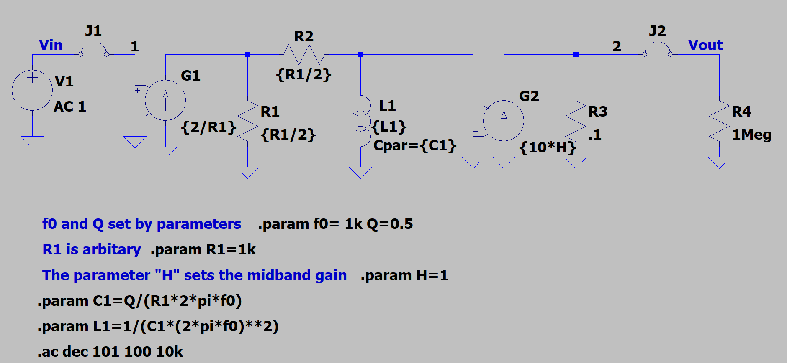
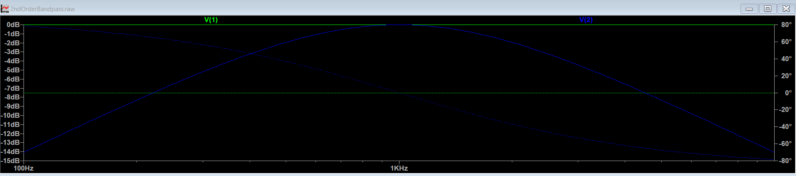
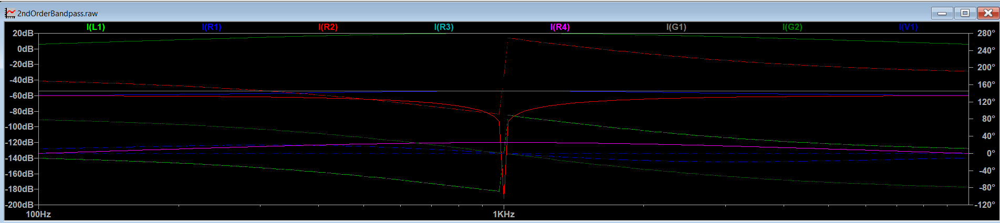

# Parametric Bandpass Filter Simulation

This repository contains an LTspice (or generic SPICE) simulation of a configurable bandpass filter. The design uses behavioral models to let you set the center frequency (\( f_0 \)), quality factor (\( Q \)), and midband gain (\( H \)) via parameters, making it ideal for educational use, design exploration, and transfer function analysis.

## Features

- **Parametric Design**: Set \( f_0 \), \( Q \), and \( H \) directly as parameters
- **Behavioral Sources**: Realized using voltage-controlled current sources for flexible simulation
- **Arbitrary Component Values**: \( R_1 \) is arbitrary for scaling; component values for \( L_1 \) and \( C_1 \) are auto-calculated from parameters
- **Easy Frequency Sweep**: Includes sample `.ac` command for sweep simulation

## Schematic Overview

- **Adjustable Parameters**:  
  - `f0` = Center frequency (default: 1 kHz)
  - `Q` = Quality factor (default: 0.5)
  - `H` = Midband gain (default: 1)
  - `R1` = Arbitrary resistance reference (default: 1 kΩ)
- **Formulas**:
  - `C1 = Q/(R1*2*pi*f0)`
  - `L1 = 1/(C1*(2*pi*f0)^2)`
 
    

    
    

## Usage

1. Open the schematic in LTspice.
2. Adjust the `.param` lines to set your desired \( f_0 \), \( Q \), and \( H \).
3. Run a transient (`.tran`) or AC sweep (`.ac`) simulation as desired.
4. Analyze the input (Vin) and output (Vout) waveforms to observe filter behavior.

## Example Simulation Results

- The bandpass filter amplifies signals near the center frequency, as shown by the output waveform exceeding input amplitude at resonance.
- The phase and amplitude response align with standard bandpass characteristics.

## License

This project is open-source for educational and prototyping use.
